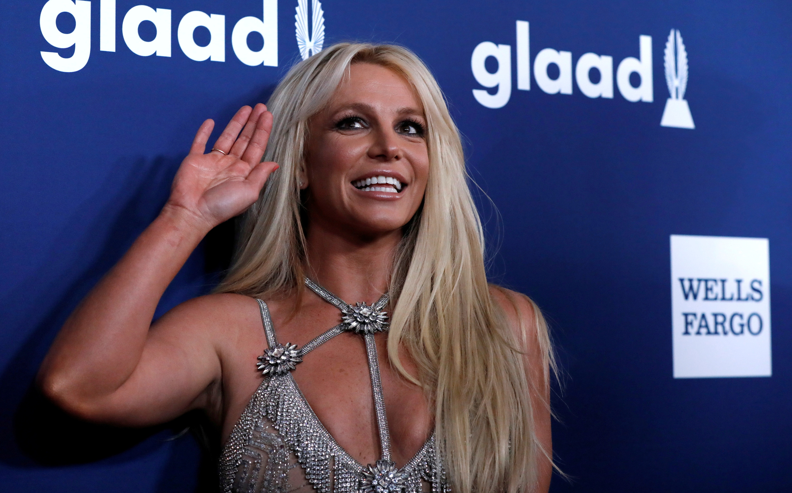

# Britney en una nueva aventura: 
### Britney la exploradora
Plantilla para crear mi historia interactiva de la asignatura [Creatividad e innovación Audiovisual](https://www.ugr.es/estudiantes/grados/grado-comunicacion-audiovisual/creacion-difusion-nuevos-contenidos-audiovis), repositorio de proyectos y documentación en https://github.com/mgea/storytelling

Autores:  
<!---
Incluir lista de personas del grupo 
Se puede añadir enlace a página personal de github o lo que se quiera...(optativo)
-->

- :man: Alejandro Guerrero
- :woman: África Torices
- :woman: Victoria Pamos

Proyecto (código): 
URL (link) del proyecto en Github: 

Tipo/Género:  
- [ ] FictionCiberpunk  
- [x] Reality/tribus urbanas  
- [ ] Comic

## Resumen

### Personaje

Nombre: Britney Spears

### DESCRIPCIÓN
Cantante y bailarina estrella del pop de los 2000, retirada desde hace unos años debido a diferentes polémicas y injusticias que ha sufrido durante su carrera musical.

### PERSONALIDAD
Mujer de mucho talento, coraje y fortaleza que a pesar de que sus círculo más cercano fuese contra ella siempre luchó por seguir adelante y mantener su esencia. Por ello tiene un gran corazón y siente gran debilidad por los más débiles.

### OBJETIVO
Salvar al mono Punch del zoo en el que lo marginan y darle una vida digna junto a ella.

### DESARROLLO
Britney conoce a través de redes sociales la terrible historia del mono Punch y se siente muy afectada por la situación. Se arma de valentía y viaja hasta Japón dónde actúa como una madre protectora. Al llegar allí se sorprende mucho al ver que todo está preparado para la grabación de su nuevo videoclip junto a una quedada de therians.

### DESCRIPCIÓN
Punch es un pequeño mono de 7 meses que fue rechazado por su madre justo después de nacer. Estaba tan triste que sus cuidadores le dieron un peluche al que abrazar y del cual no se separaba. Esta noticia se acabó haciendo viral y dio la vuelta al mundo, tanto que llegó a los oídos de Britney.

### PERSONALIDAD
Punch es un mono tímido y dependiente. Tiene una cara muy tierna con ojos grandes y brillantes. Abraza su peluche como si se tratara de un tesoro.

### OBJETIVO
El objetivo de Punch es ser querido por el resto de monos. Sin embargo, en el zoológico no había más monos, habían Therians.

### DESARROLLO
El Mono Punch comienza esta historia siendo un mono triste y afectado por el rechazo de su madre. No obstante, al recibir un monito de peluche de parte de los cuidadores se vuelve un poco más optimista. Finalmente, al observar la llegada de Britney al zoo junto con los Therians y el despliegue de cámaras por el videoclip, se siente abrumado con la situación.

NOTA: La ficha del personaje se puede hacer con la pizarra online https://excalidraw.com/ y la plantilla que se tiene en este repositorio llamada [ficha_personaje.excalidraw](ficha_personaje.excalidraw)    
* hay que descargarla al ordenado y usarla en excalidraw con la opción archivo > Abrir

### Historia
Britney Spears descubre en redes la desgarradora historia de Punch, un monito sumido en la tristeza tras ser rechazado por su madre biológica. Conmovida por un dolor que siente como propio, la cantante se llena de valentía y viaja hasta Japón con el único propósito de brindarle el afecto y la protección de una madre. Mientras tanto, en el zoo, Punch ha logrado recuperar una chispa de optimismo gracias a un pequeño mono de peluche que le regalaron sus cuidadores y que se ha convertido en su único refugio.

Sin embargo, al llegar al lugar, Britney se queda atónita: no hay silencio ni intimidad, sino un despliegue masivo de cámaras, luces y neones preparados para la grabación de su nuevo videoclip. El set está rodeado por una multitud de therians que, con sus máscaras y movimientos animales, se han reunido para participar en el evento. Al verse frente a frente con Britney, pero rodeado por el estruendo técnico y la extraña presencia de los therians, el pequeño Punch se siente completamente abrumado y asustado por el caos que ha traído consigo su inesperada aparición en el videoclip.
### TagLine

### Conflicto 

### Productos

- Personajes:
  

- Banner/Teaser:  (enlace) 

- Storytelling: (enlace) 

### Conclusiones/Valoración del equipo
A través de este proyecto hemos aprendido a trabajar con herramientas colaborativas para elaborar nuestras ideas. Nos ha resultado una actividad divertida, interesante y a pesar de la dificultad, muy útil. Gracias a ella hemos podido desarrollar nuestra creatividad sobre todo gracias a la puesta en común de todos las ideas de los integrantes del grupo. Nos hemos visto enriquecidos debido a las diferentes herramientas utilizadas durante el desarrollo de nuestro proyecto.

------

<!---
Lista completa de emojis de markDown - https://gist.github.com/rxaviers/7360908) 
-->

Febrero, 202X

Proyecto dentro de la serie [Narrativas interactivas](https://github.com/mgea/storytelling/blob/master/What_is_a_digital_storytelling.md) 
Proyectos seleccionados de [2023](https://github.com/mgea/storytelling/tree/master/2023), [2022](https://github.com/mgea/storytelling/blob/master/2022/readme.md) / [2021](https://github.com/mgea/storytelling/blob/master/2021/readme.md) / [2020](https://github.com/mgea/storytelling/blob/master/2020/readme.md)  / 
[2019](https://github.com/mgea/storytelling/blob/master/2019/readme.md) / [2018](https://github.com/mgea/storytelling/blob/master/2018/readme.md) 

CC BYNCSA [Creatividad e Innovación Audiovisual-B](https://github.com/mgea/criav/)

 

[Facultad de Comunicación y Documentación](http://fcd.ugr.es)

Universidad de Granada
